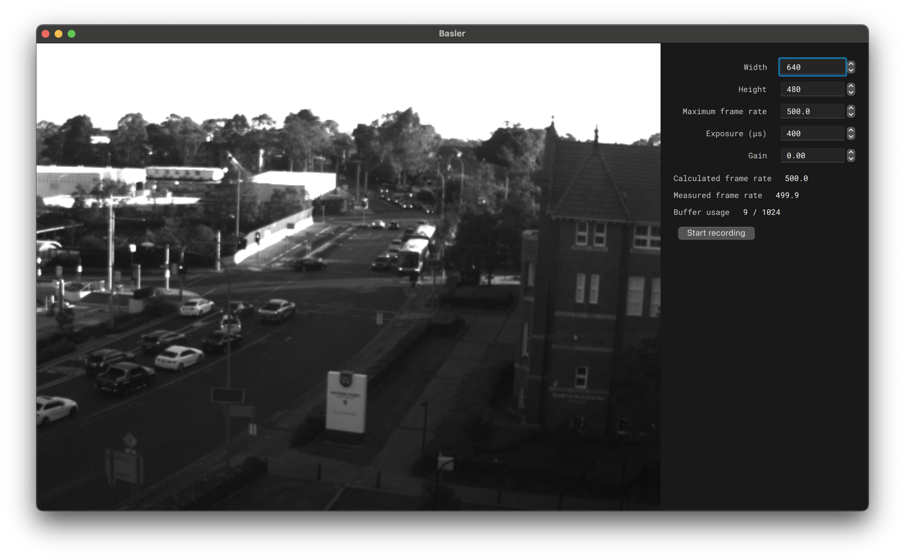

GUI for the BASLER acA640 750um (grey levels).

Tested on macOS 15.1.1 (Apple silicon) and Windows 11 (x86).

## Installation

```sh
python3 -m venv .venv
source .venv/bin/activate  # Windows: .venv\Scripts\activate.ps1
pip install maturin==1.8.3
maturin develop
```

## Usage

1. Start the GUI and record data.

    ```sh
    python record.py
    ```

    Recordings are saved in _recordings_ (in this directory).

2. Convert recorded binary blobs (".basler" files) to JSON metadata, PNG images, and mp4 videos.

    ```sh
    python render.py
    ```

    The PNG frames are a lossless representation of the original data (the camera encodes grey levels on 10 bits, the PNG frames use 16 bits). The mp4 video, whilst convenient for data inspection, is a lossy representation that should be avoided for data analysis and algorithm development.

    The timestamps (see _timestamps.json_) are generated by the camera's internal clock with nanosecond resolution (but possible clock drifts).

    The ".basler" binary format is a bespoke format used here for performance and simplicity.
